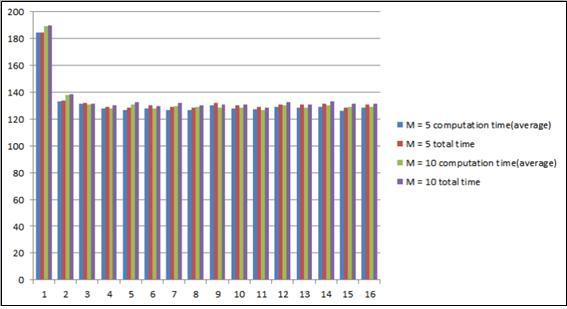

우선순위를 적용한 스케줄링
============
>학과 수업인 운영체제의 마지막 과제로 행렬곱을 계산하는 과정을 여러 개의 worker thread들을 생성하여 유한개의 buffer에서 우선순위 큐로 동작하는 환경을 만들어 분석하였다.

개발 기간 및 환경
-------------
* 기간 : 2016.05 ~ 2016.06
* OS : Linux Ubuntu
* Language : C
* Tools : Visual Studio 2013

프로그램 진행순서도 
-------------
1. 사용자로부터 스레드(worker)의 개수와 buffer의 크기를 입력받는다.
2. pthread_t변수를 worker thread의 수만큼 배열로 생성한다.buffer를 buffer의 크기만큼 동적 할당한다.
3. 전체 수행시간측정을 시작한다.
4. sem_t 변수 work_sem, empty, full을 sem_init을 이용해 초기화한다.
5. pthread_create를 사용해 입력받은 만큼의 worker thread를 생성한다.
6. (worker) idle상태로 작업이 주어질 때까지 대기한다.(main) a.dat, b.dat 파일을 A행렬, B행렬에 읽어 오고 수행시간을 측정한다.
7. 요청시작시간 측정을 시작한다. 
8. (main) buffer가 full이 아닐 경우 우선순위를 적용해 heap에 삽입한다.(worker) buffer가 비어있지 않을 경우 heap에서 추출해 작업을 수행하고 buffer정보를 출력하고 계산 시간을 저장한 뒤 다시 idle 상태로 돌아간다.*8번의 과정을 모든 행을 수행할 때까지 반복한다.
9. (main) 모든 worker 종료시키기 위해 buffer에 행은 –1, 우선순위는 2를 넣는다.(worker) 우선순위 0, 1인 작업이 모두 끝나고 행 번호가 –1이고 우선순위가 2인 경우 계산시간을 출력하고 pthread_exit를 수행한다.(main) pthread_join을 통해 worker를 기다린다.
10. 동적 할당했던 buffer을 free해준다.사용한 세마포를 sem_destroy를 사용해 끝낸다.
11. C행렬을 c.dat 파일에 쓴다.
12. 전체 수행시간측정을 종료하고 read, total시간을 출력한다.

결과 분석 그래프
-------------
